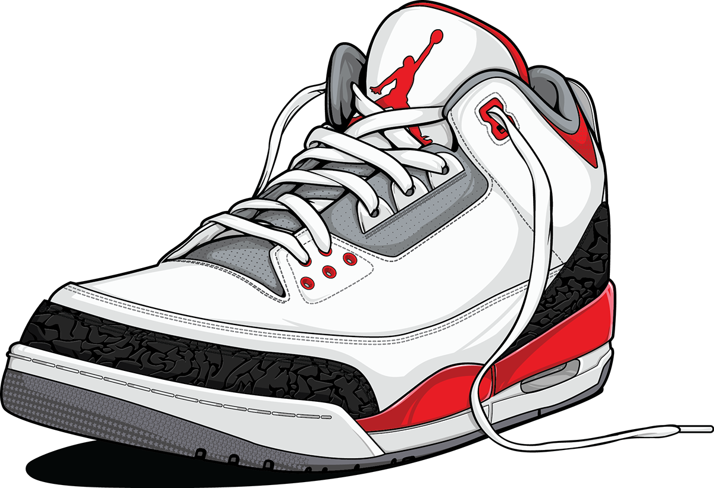
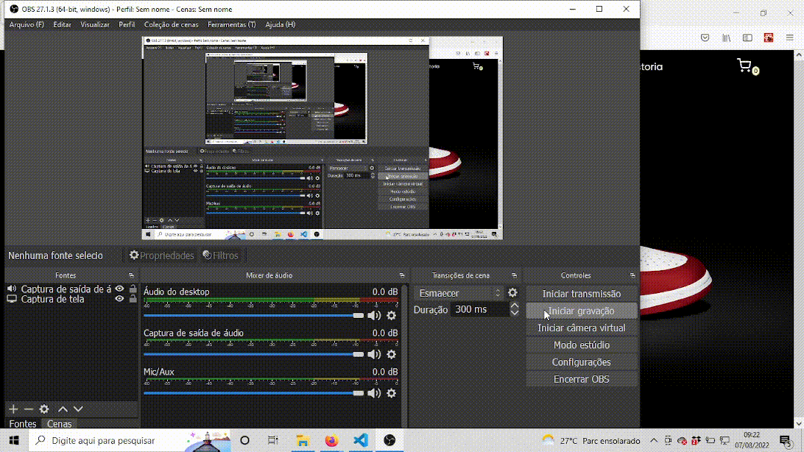

<h1 align="center">
  
</h1>

# WebSneaker

  

  

  

  

 

## 💻 Projeto

Projeto de uma loja de sapatos que possibilita escolha pela marca e adicionar os produtos ao carrinho de compra. O design foi feito por mim, fiz esse projeto para exercitar ainda mais conceitos muito importantes como router, context, estado, noções de estilização, etc...

 

## 🌐 Preview

<h1 align="center">
    
</h1>

## 🚀 Tecnologias

Esse projeto foi desenvolvido com as seguintes tecnologias:

- [React](https://reactjs.org)
- [Typescript](https://www.typescriptlang.org/)
- [Styled Components](https://styled-components.com/)
- [React Router](https://reactrouter.com/en/main)
- [Context](https://pt-br.reactjs.org/docs/context.html)

 

  Made with 💙 by <a href="https://www.linkedin.com/in/natan-xavier-a266a0228/"> Natan Xavier </a>

